# Практическая работа #10
## JWT-аутентификация: создание и проверка токенов. Middleware для авторизации
## Саттаров Булат Рамилевич ЭФМО-01-25

--- 
## Описание
В работе реализована система аутентификации и авторизации на основе JWT-токенов:
-	/login — выдача пары токенов access + refresh
-	/refresh — обновление токенов с автоматической ревокацией старого refresh
-	/me — получение данных текущего пользователя	
- /admin/stats — доступно только администратору	
- /users/{id} — ABAC: пользователь может получить только свои данные, администратор — данные любого пользователя

Используются middleware:
-	AuthN — проверка подписи и декодирование токена
-	AuthZ — проверка ролей (RBAC)
-	Error — преобразование ошибок в единый JSON-формат
-	Logging — логирование запроса (метод, путь, статус, время обработки)
-	Rate limit — ограничение количества попыток логина

## Команды запуска и переменные окружения
Запуск 
```
go run ./...
```
Переменные 
- APP_PORT – порт
- JWT_ACCESS_TTL – время жизни access 
- JWT_REFRESH_TTL – время жизни refresh 
- JWT_ACTIVE_KID – какой ключ использовать


## Скриншоты
### Логин
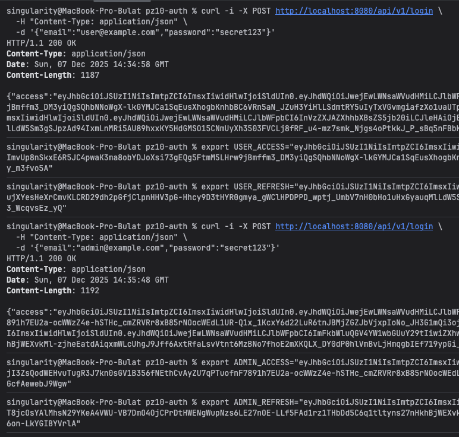
### Запрос себя /me
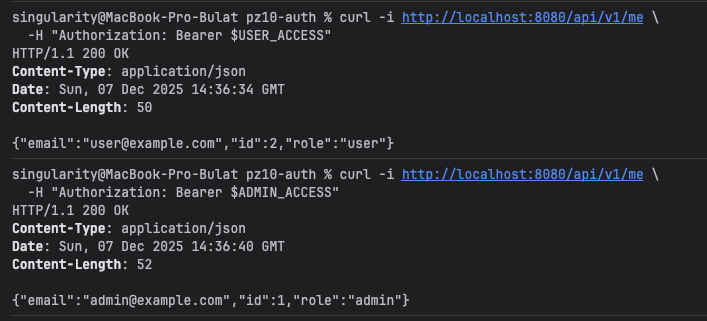
### /stats от админа и юзера
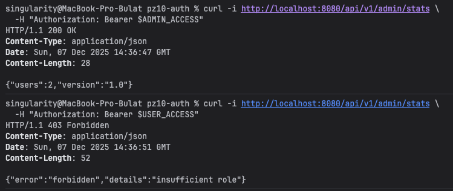
### ABAC запрос данных пользователя по id
#### От роли user только себя (запросив другого 403)
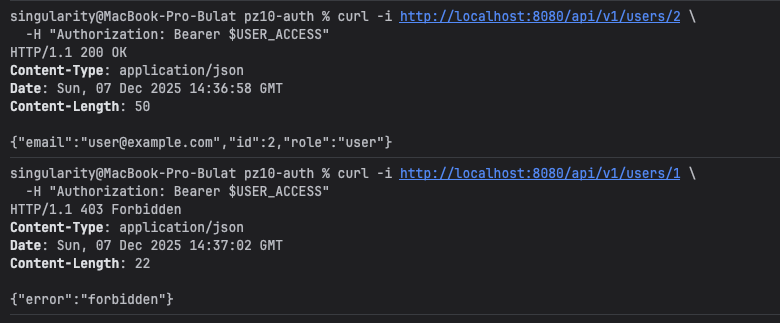
#### От роли admin всех
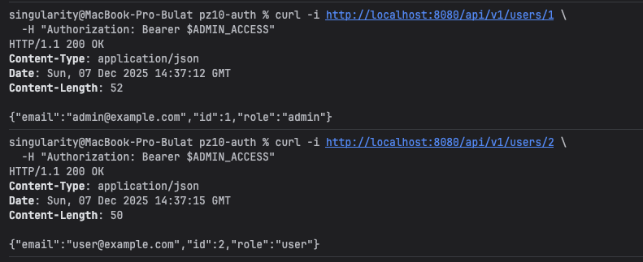
#### Refresh
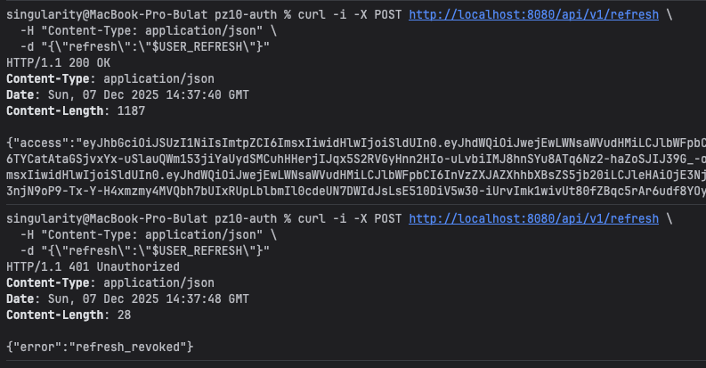

## Доп задания
### RS256
#### Измененный конфиг

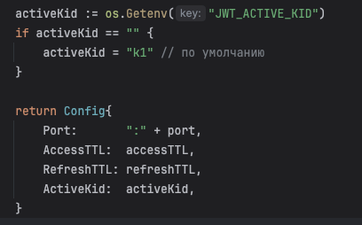
#### Генерация ключей
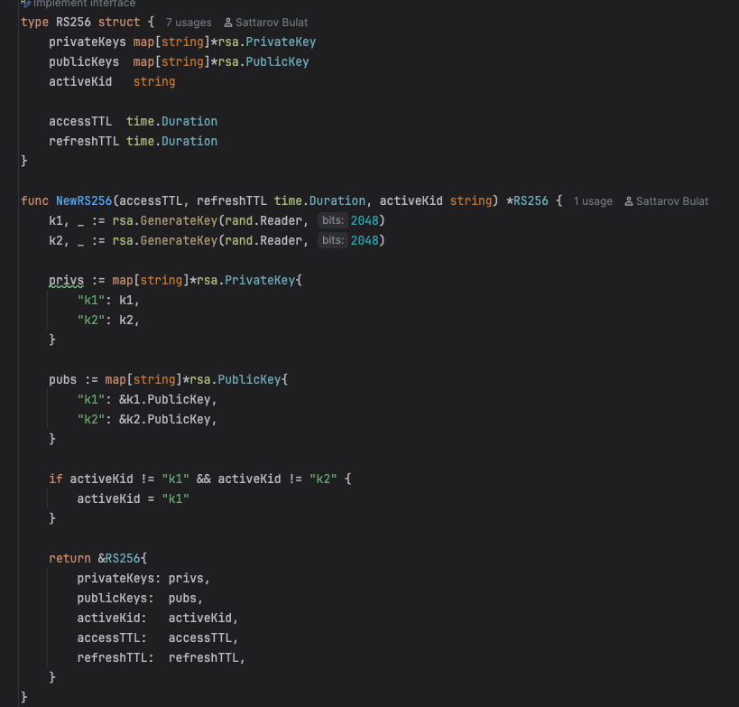
#### Вызов в роутере
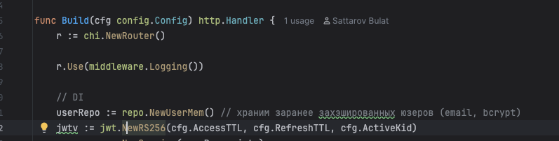

### Rate limit
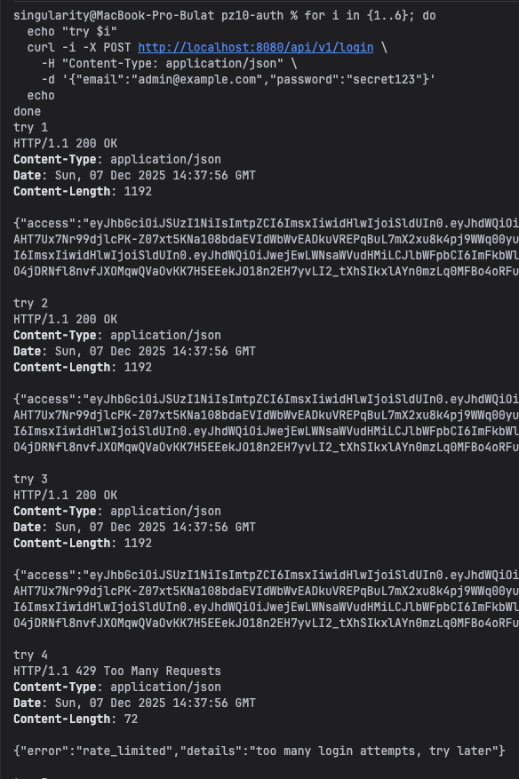

### Logging через logging.go
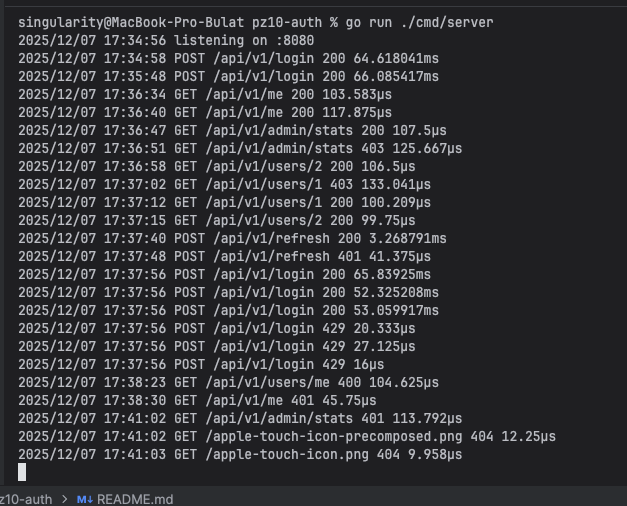

### Единый формат ошибок через middleware errors.go
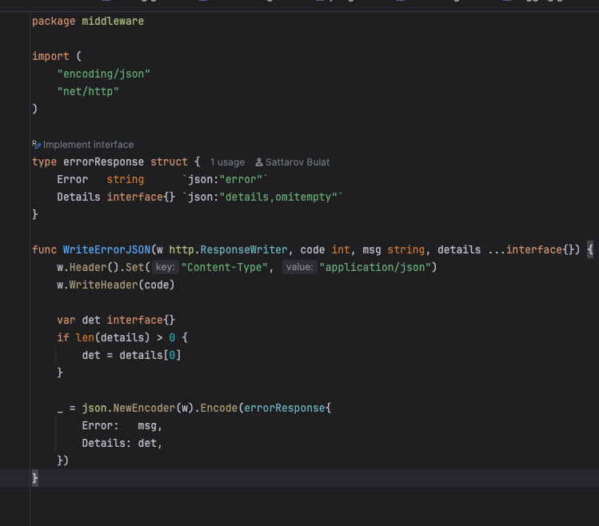
#### Пример применения
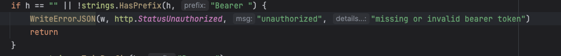
#### Вывод ошибки
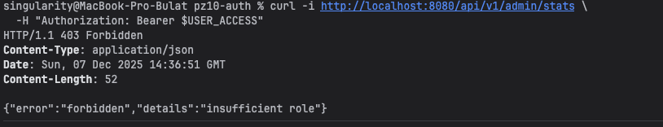

